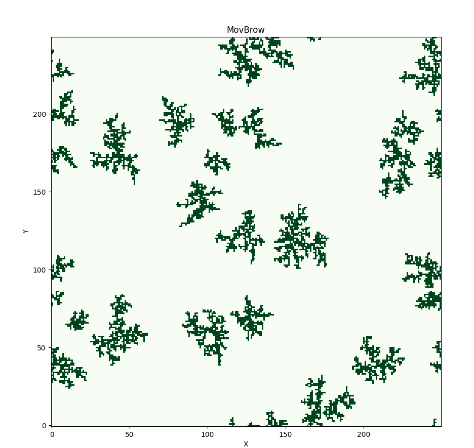
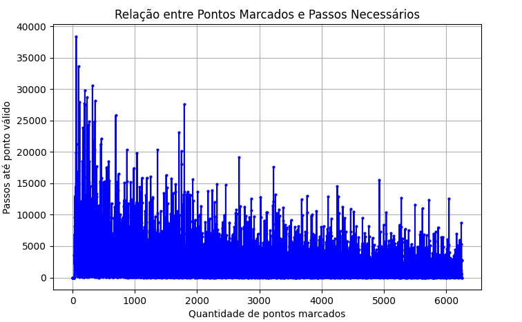

# Versão 1

### Matriz de Posição dos Pontos Marcados

Abaixo está a representação da matriz com os pontos marcados ao longo do processo.

Como o movimento começa a partir do centro da matriz, você provavelmente verá uma concentração maior de pontos próximos ao centro, com a distribuição dos pontos se expandindo conforme o programa executa.

Conforme o número de pontos aumenta, você verá que a distribuição dos pontos começa a formar uma estrutura conectada, com pontos interligados entre si, o que sugere que os movimentos aleatórios começaram a explorar mais a grade.

### Gráfico de Passos por Ponto

A partir do gráfico, podemos observar que conforme mais pontos são marcados na grade, o número de passos necessários para encontrar um ponto válido tende a diminuir. Isso ocorre porque, à medida que mais vizinhos válidos (com valor 1) estão presentes na grade, as opções para a movimentação se tornam mais abundantes, tornando o processo de encontrar um vizinho mais eficiente.

# Versão 2

### Matriz de Posição dos Pontos Marcados

Nesta versão, aumentei a quantidade de pontos fixos iniciais — no exemplo abaixo, são 25 — o que significa que, além do ponto central, outras posições da matriz já iniciam marcadas. Isso permite que os novos pontos formem "ilhas" de crescimento de forma aleatória.

### Gráfico de Passos por Ponto

Também é possível observar que a quantidade de passos necessários para que um ponto aleatório se torne válido diminuiu consideravelmente. Isso demonstra que quanto maior a quantidade de pontos fixos iniciais, menor tende a ser o número de tentativas até que um novo ponto seja aceito, confirmando uma relação proporcional entre esses fatores.

